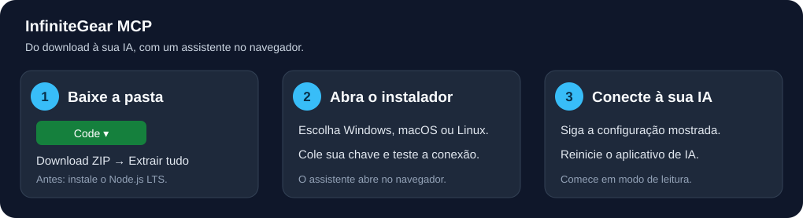
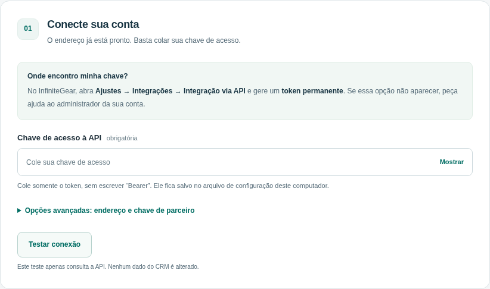

<div align="center">

# InfiniteGear MCP

**Seu CRM conectado ao seu aplicativo de IA.**

[Instalar no computador](docs/instalacao-local.md) · [Instalar em uma VPS](docs/vps.md) · [Documentação InfiniteGear](https://infinitegear.readme.io/llms.txt)



</div>

Conecte contatos, conversas, mensagens, painéis e operações administrativas à sua IA. O catálogo incluído oferece **120 operações da API**, além de pesquisa na documentação e upload de arquivos em três etapas. A URL InfiniteGear já vem preenchida: você precisa apenas da chave permanente da conta.

> Os contratos oficiais e os transportes MCP foram testados com respostas simuladas. O botão **Testar conexão** verifica o acesso à sua conta sem alterar dados. Permissões e disponibilidade de cada operação dependem da conta e da versão da API.

## Quero instalar no meu computador

**[Baixar o InfiniteGear MCP em ZIP](https://github.com/drdanieldorta/InfiniteGear-MCP/archive/refs/heads/codex/infinitegear-mcp.zip)**

Não é preciso saber programar. O [guia ilustrado](docs/instalacao-local.md) explica como extrair o ZIP, instalar o Node.js LTS e abrir o assistente.

Esta versão está em revisão no [PR #1](https://github.com/drdanieldorta/InfiniteGear-MCP/pull/1). O link acima baixa a versão que contém os instaladores.

| Seu computador | Abra este arquivo na pasta extraída |
| --- | --- |
| Windows | **Instalar-Windows.cmd** |
| macOS | **Instalar-macOS.command** |
| Linux | Execute **`bash instalar-linux.sh`** no terminal |

No assistente, cole a chave da conta, teste a conexão e escolha seu aplicativo: Claude Desktop, Cursor, VS Code ou outro com MCP local. O catálogo já está instalado. A chave de parceiro e a edição do endereço ficam nas opções avançadas.



**Para o Claude Desktop:** há também suporte a um pacote `.mcpb`, que abre um formulário de instalação no próprio aplicativo. O projeto gera esse arquivo; a publicação de um download em Releases ainda não foi realizada. [Como obter ou gerar o pacote](docs/empacotamento.md).

## Quero instalar em uma VPS

Use o [guia Docker](docs/vps.md). Ele explica como configurar o arquivo `.env`, iniciar o serviço, conferir o funcionamento e colocar HTTPS na frente do endpoint `/mcp`.

O acesso remoto usa uma senha exclusiva para o MCP, diferente da chave do CRM. O aplicativo de IA precisa aceitar MCP por **Streamable HTTP com token Bearer**. Clientes que exigem login OAuth não são atendidos por esse modo nesta versão.

## O que este projeto oferece

- **Instalação guiada em português**, com campos mascarados e configurações prontas para copiar.
- **MCP local e remoto**, usando o SDK oficial e sem banco de dados adicional.
- **Operações geradas por OpenAPI**, com validação dos campos antes de chamar a API.
- **Upload completo**, que solicita a URL, envia o arquivo e devolve um ID para reutilizar nas mensagens.
- **Token de parceiro separado**, para operações administrativas que o exigem.
- **Somente consultas por padrão**; criar, editar, excluir e enviar mensagens exige habilitar alterações.
- **Índice da documentação**, organizado em Core, Chat e CRM.
- **Docker e extensão `.mcpb`**, sem exigir publicação em um registro npm.

A API usa **`https://api.crm.infinitegear.app`**, conforme a documentação InfiniteGear. O instalador já usa esse endereço. [Veja onde gerar sua chave](docs/conexao-infinitegear.md).

## Exemplos de uso

Depois de conectar:

> “Pesquise na documentação InfiniteGear como listar contatos.”

> “Liste os contatos usando os filtros disponíveis.”
>
> “Mostre os painéis do CRM.”

O catálogo cobre contatos, carteiras, usuários, equipes, etiquetas, arquivos, webhooks, conversas, mensagens, chatbots, modelos, sequências, agendamentos, contas de parceiro e cards. São **57 operações Core, 50 Chat, 12 CRM e 1 de login integrado**. Criar, editar, excluir, enviar mensagens, enviar arquivos e gerar links de login exige habilitar alterações.

## Para quem desenvolve

Requisitos: Node.js **22 ou superior** e npm. Na pasta do repositório:

```bash
npm ci
npm test
npm run setup
```

| Comando | Finalidade |
| --- | --- |
| `npm start` | Iniciar MCP por stdio; normalmente o aplicativo de IA faz isso. |
| `npm run setup` | Abrir o assistente no navegador deste computador. |
| `npm run doctor` | Verificar configuração, catálogo e uma consulta real; retorna erro se faltar um requisito. |
| `npm run doctor -- --partner` | Verificar o token de parceiro com uma consulta administrativa. |
| `npm run start:http` | Iniciar MCP HTTP autenticado; exige `INFINITEGEAR_MCP_TOKEN`. |
| `npm run import:api -- /caminho/openapi.json` | Importar uma especificação oficial local. |
| `npm run package:mcpb` | Gerar a extensão em `dist/`, com SHA-256. |

Os testes exercitam chamadas MCP reais por stdio/HTTP contra uma **API simulada**, validação de parâmetros, permissões, credenciais, redirecionamentos e proteção do assistente local. Eles não substituem a validação da conta InfiniteGear. A [CI no GitHub](https://github.com/drdanieldorta/InfiniteGear-MCP/actions/workflows/ci.yml) executa os testes em Node 22/24 e Windows/macOS/Linux e gera o pacote para desktop.

[Configuração e cobertura da API](docs/configuracao-api.md) · [Instalação local](docs/instalacao-local.md) · [VPS](docs/vps.md) · [Empacotamento](docs/empacotamento.md)
